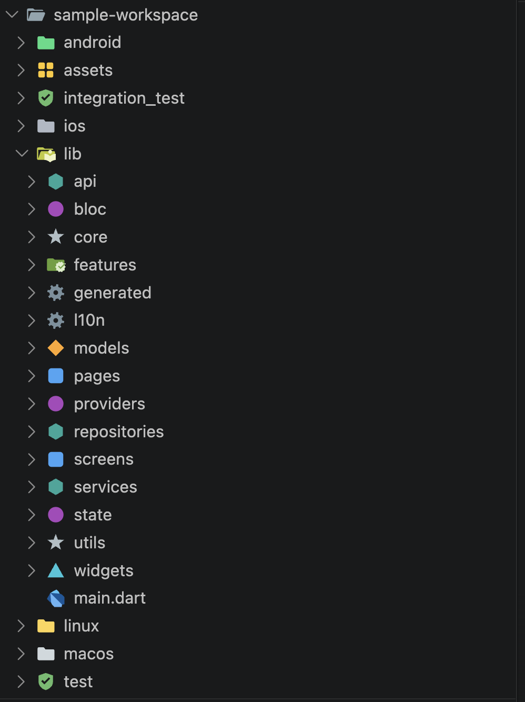

# Flutter Folder Lens

**Make your Flutter project structure instantly scannable.** Flutter Folder Lens is a Flutter-aware **file icon theme**: folders like `screens`, `widgets`, `models`, `bloc`, `services`, `test` and the platform directories get distinct colored, shape-based icons in the Explorer — like Material Icon Theme, but built around Flutter conventions.




## Getting started

1. Install the extension. On first run it offers to activate the icon theme.
2. Or activate manually: **Preferences: File Icon Theme** → **Flutter Folder Lens** (this sets `workbench.iconTheme`).

Because VS Code applies exactly one file icon theme at a time, Flutter Folder Lens must be your active icon theme for its icons to show. Don't worry about losing your current icons: by default your previous theme is imported as the base and only the Flutter folder icons are layered on top — see [File icons are not affected](#file-icons-are-not-affected).

## Default folder icons

| Folder name | Icon |
| --- | --- |
| `screens`, `pages` | blue rounded square |
| `widgets` | cyan triangle |
| `models` | orange diamond |
| `providers`, `bloc`, `cubit`, `state`, `riverpod` | purple circle |
| `services`, `repositories`, `data`, `api` | teal hexagon |
| `utils`, `helpers`, `core` | gray star |
| `test`, `tests`, `test_driver`, `integration_test` | green check-shield |
| `assets`, `images`, `fonts` | yellow grid |
| `android`, `ios`, `web`, `macos`, `windows`, `linux` | platform-tinted folders |
| `l10n`, `generated` | dimmed gear |

Every icon has closed and expanded (open) variants, is drawn on a crisp 16px grid, and palette colors ship separate dark- and light-theme fills.

> **Name-only matching.** VS Code icon themes match folders by *name*, not by path — `models` gets its icon whether it's `lib/models` or `packages/app/lib/models`, but you cannot scope a rule to `lib/models` only. This is a platform limitation of `folderNames` / `folderNamesExpanded`.

## Custom rules

Right-click any folder → **Flutter Folder Lens: Set Icon for Folder…**, pick a shape and color, done. Icons are regenerated and you'll be prompted to reload the window. Or edit settings directly:

```jsonc
"flutterFolderLens.rules": [
  { "folderName": "genkit",   "shape": "star",    "color": "red" },
  { "folderName": "features", "shape": "hexagon", "color": "#7C4DFF" },
  // your rules always win over the built-in defaults
  { "folderName": "screens",  "shape": "circle",  "color": "green" }
]
```

- **Shapes:** `circle`, `square`, `triangle`, `diamond`, `hexagon`, `star`, `shield`, `grid`, `gear`, `folder`.
- **Colors:** palette names (`blue`, `cyan`, `orange`, `purple`, `teal`, `gray`, `green`, `yellow`, `red`, `dimmed`, platform tints) or any `#rrggbb` hex. SVGs are generated at runtime from shape templates, so custom colors need no bundled assets.
- Set `"flutterFolderLens.useDefaultRules": false` to start from a blank slate.

Rules persist in your **user settings** (icon themes are global to the window, so workspace-scoped rules would thrash the shared theme when switching projects).

## File icons are not affected

Flutter Folder Lens only wants to own **folder** icons. By default (`"flutterFolderLens.baseIconTheme": "auto"`) it imports whichever icon theme was active before you switched — Material Icon Theme, Seti, anything installed — as the base, and layers the Flutter folder icons on top. Your file icons (TypeScript, YAML, JSON, …) and any folders we don't have a rule for keep looking exactly as before. If no previous theme is found it falls back to VS Code's built-in Seti.

```jsonc
"flutterFolderLens.baseIconTheme": "auto"                 // default: your previous theme
"flutterFolderLens.baseIconTheme": "material-icon-theme"  // or pin an explicit theme id
"flutterFolderLens.baseIconTheme": ""                     // minimal built-in set only
```

The base theme's icons and fonts are copied into the generated theme so they always load; the base extension only needs to be installed when icons are (re)generated. Switching your icon theme to something else and back re-imports the new base automatically.

## How it works (and why a reload prompt)

The extension generates the icon theme JSON and SVG files into its own installation directory whenever your configuration changes, then prompts for a window reload — VS Code only reads icon theme files once. Generation is idempotent: unchanged configuration writes nothing and never prompts.

## Commands

| Command | What it does |
| --- | --- |
| **Flutter Folder Lens: Set Icon for Folder…** | Quick-pick shape + color for a folder name; persists the rule to user settings. Also in the Explorer context menu. |
| **Flutter Folder Lens: Regenerate Icons** | Force-regenerates the theme files. |
| **Flutter Folder Lens: Reset to Defaults** | Removes all custom rules and settings. |

## Settings

| Setting | Default | Description |
| --- | --- | --- |
| `flutterFolderLens.rules` | `[]` | Custom `{folderName, shape, color}` rules, merged over the defaults. |
| `flutterFolderLens.useDefaultRules` | `true` | Apply the built-in Flutter conventions. |
| `flutterFolderLens.baseIconTheme` | `"auto"` | Base icon theme: `"auto"` (previous theme, Seti fallback), an explicit theme id, or empty for the built-in minimal set. |

## Migrating from 0.1.x

Version 0.1.x decorated folders with **badges** via the `FileDecorationProvider` API. That approach could only add a 2-character label next to the folder name — it could not change the folder icon itself. 0.2.0 replaces it entirely with a real icon theme:

- The badge decorations, the `assignBadge`/`refresh`/`toggle` commands, the `flutterFolderLens.enabled` setting and the `flutterFolderLens.*` theme colors are **gone**.
- Old `rules` entries in the `{glob, badge, color}` format are ignored (harmlessly) — recreate them as `{folderName, shape, color}`. Note the trade-off: badges matched full paths (`lib/**/screens`); icon themes match names only.
- You must select the **Flutter Folder Lens** icon theme for anything to show — decorations worked on top of any theme, icons cannot.

## Notes & limitations

- One icon theme at a time is a VS Code constraint; the `baseIconTheme` setting exists to soften it.
- Matching is by folder basename only (see above).
- After changing rules, a window reload is required for VS Code to pick up the regenerated theme.

## Release notes

See [CHANGELOG.md](CHANGELOG.md).

## License

[MIT](LICENSE)
